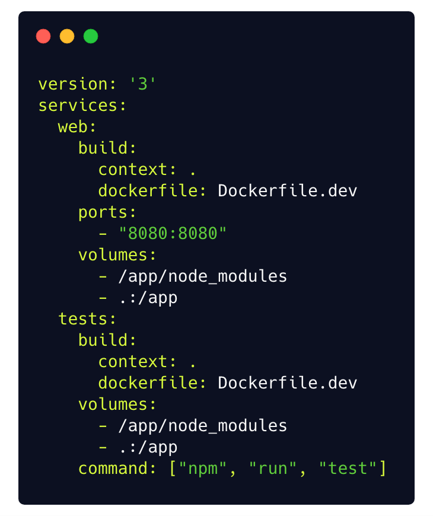
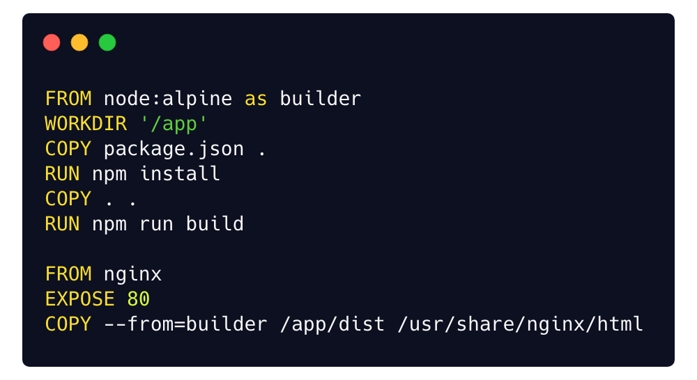

Application containers include the runtime components -- such as files, environment variables and libraries -- necessary to run the desired software. Application containers consume fewer resources than a comparable deployment on virtual machines because containers share resources without a full operating system to underpin each app. The complete set of information to execute in a container is the image. The container engine deploys these images on hosts.

> This project demonstrates the use of containerization and CI/CD, The
> project makes use of the following technologies:

**Docker**

Docker is a computer program that performs operating-system-level virtualization. This project uses docker to containerise the application

**AWS**

AWS is a service that provides on-demand cloud computing platforms for individuals and companies. This project uses AWS elastic beanstalk to host the containerise application.

**Travis CI**

Travis CI is a hosted, distributed continuous integration service used to build and test software projects hosted at GitHub. This project uses Travis to run test and deploy the application to EBS (Elastic Beanstalk)

##  How containers work with the application.

This project uses the following docker files

**1.  Dockerfile.dev**

 

 
The Dockerfile.dev file is used during development, this file is used to create an image during development.

    -   I used a node alpine image because it is smaller
    -   I set the working directory as '/app'
    -   I install the dependencies
    -   I copied all the files into the working directory
    -   I start the app

For the container to work effectively during development i created a docker-compose. The docker compose is used to start a container with the image during development

**The docker-compose file runs two services.**
 

 
The first service is the ***web service*** which builds the image and starts the app,
it also exposes port 8080 on the host to port 8080 in the container,
and creates a volume that maps the current directory to the app directory in the container. It also sets the node_modules volume, this enables the container to watch for changes during development.

The second service is the test service, the test service builds the image and overrides the default command with `npm run test` command which ensures that the container watch for changes in the test and runs them accordingly.

**2. Dockerfile**
 

 
The Dockerfile is use for production, It also uses the node alpine image

    -   I am setting the first step as the builder
    -   I set the working directory as '/app'
    -   I copy the package.json file
    -   I install the dependencies
    -   I copied all the files into the working directory
    -   I build the application

The next step uses the output from the `builder` step

    I install nginx and expose port 80 
    I copied the dist folder from the first step into the nginx html directory

**Travis setup**

I created the `travis.yml` which is responsible for running test and deploying the application.

   - I installs docker
   -  Build the image from the Docker.dev file
   -  Create a container from the image generated above and run test

if the test is successful and the branch is master, it runs the deployment step which deploys the app to AWS elastic beanstalk

## Steps to run the app

-   Clone the repo
-   Setup a Travis account
-   Login into AWS console
-   Search for [Elastic Beanstalk](https://docs.aws.amazon.com/console/quickstarts)
-   Click on create an application
-   Enter the name as docker-react and click on submit
-   Click on create an environment
-   Select Web server environment and click on select
-   Scroll to Preconfigured platform and select docker
-   Click on create
-   Create a github repo and push the application to the repo
-   Link the repo to Travis