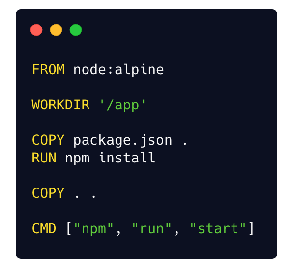
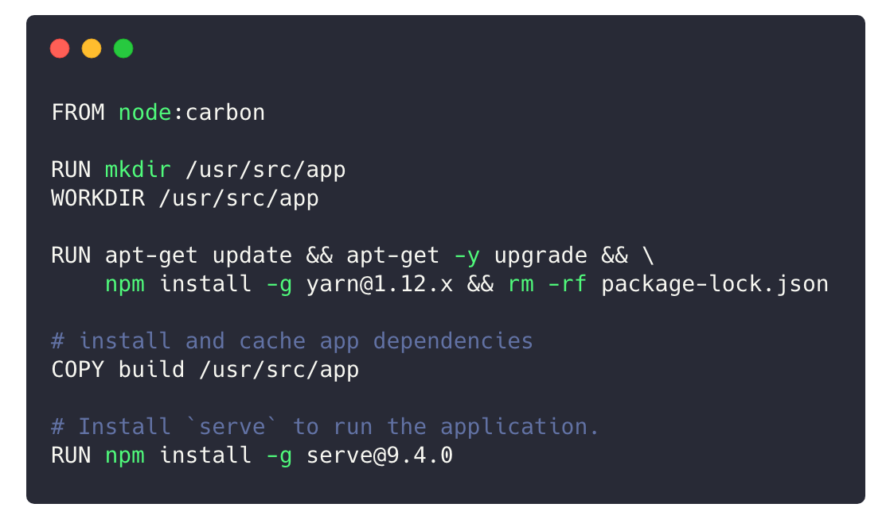

## What is containerization

Containerization is the process of encapsulating your application into a container.

It involves bundling an application together with all of its related configuration files, libraries and dependencies required for it to run in an efficient and bug-free way across different computing environments.

In the areas of software development, containerization is the encapsulation of an application with its own operating environment which can be run on any host machine without installing any more dependencies. It is a uniform structure in which an application can be stored.

The most popular containerization ecosystems are Docker and Kubernetes.

**What is Docker**

Docker is a tool that makes it easier to create, deploy, and run any applications by using containers. Containers allow a developer to package up an application with all of the parts it needs, such as libraries and other dependencies, and ship it all out as one package.

**What is Kubernetes**

Kubernetes is an open source container orchestration system that is used to automate application deployment, scaling application and managing containers. It is also a platform for managing containerized workloads and service across a collection of cluster host.

At Travela we have different Docker files which we use to build the docker images that runs our application.
For development we have a docker that builds our frotend and backend images . 
For the backenmd, we use a docker compose file to run the application in developer. This docker compose file create two containers, one is the *app container* this runs the backend functionality of the application. Another one is the *Database container* This runs a postgres image which holds the apllication database.

#### Below are the docker files for our application
- https://drive.google.com/file/d/1hk60pj22ZAd9FNKLd3yOwGMguobhS-le/view?usp=sharing
- https://drive.google.com/file/d/1ncejisAq4GrphsmozoY6FAlQxRYMBOdX/view?usp=sharing

Containerization is the process of encapsulating your application into a container.

The frontend docker file also create the frontend container which holds the frontend functionalities
It involves bundling an application together with all of its related configuration files, libraries and dependencies required for it to run in an efficient and bug-free way across different computing environments.

In the areas of software development, containerization is the encapsulation of an application with its own operating environment which can be run on any host machine without installing any more dependencies. It is a uniform structure in which an application can be stored.

The most popular containerization ecosystems are Docker and Kubernetes.

**What is Docker**

Docker is a tool that makes it easier to create, deploy, and run any application by using containers. Containers allow a developer to package up an application with all of the parts it needs, such as libraries and other dependencies, and ship it all out as one package.

**What is Kubernetes**

Kubernetes is an open source container orchestration system that is used to automate application deployment, scaling, and managing containers. It is also a platform for managing containerized workloads and service across a collection of cluster host.

**How we dockerize our application on Travela**
At Travela we have different Docker files which we use to build the docker images that runs our application.
In Development, we have a docker file that builds our frontend and backend docker images . 
For the backend, we use a docker compose file to run the application. This docker compose file create two containers, one is the *app container* this runs the backend image that holds the api functionalities of the application. Another one is the *Database container* This runs a postgres image which holds the application database.

**Backend Docker file**

> FROM node:10.13.0-alpine

The first line in our Docker file is the node image we are using. We are making use of the node alpine image, the reason why we are using this the node alpine image is because it is light weight as a result, our overall image size will be smaller

> WORKDIR /usr/app
> 
Here we are setting the working directory to /usr/app inside the container
> 
> RUN apk update && apk upgrade && \
> npm install -g yarn@1.12.x && rm -rf package-lock.json

The above lines, we are updating our packages in the image and installing yarn globally

> COPY package.json /usr/app
>  COPY yarn.lock /usr/app

Here we are copying the package.json and yarn.lock file into the app folder inside the container.

> RUN yarn install
> 
The last stage here we are running the yarn install command. This command installs all the dependencies in our application.

**Frontend Docker file**

> FROM node:carbon

We are using a node carbon image as our base image.

> WORKDIR /usr/app
> 
HHere we are setting the working directory to /usr/app inside the container
> 
> RUN apk update && apk upgrade && \
> npm install -g yarn@1.12.x && rm -rf package-lock.json

The above lines, we are updating our packages in the image and installing yarn globally

> COPY package.json /usr/app
>  COPY yarn.lock /usr/app

Here we are copying the package.json and yarn.lock file into the app folder inside the container.

> RUN yarn install
> 
The last stage here we are running the yarn install command. This command installs all the dependencies in our application.

**Frontend Docker file**

> FROM node:carbon

We are using a node carbon image as our base image.

> WORKDIR /usr/app
> 
Here we are setting the working directory to /usr/app inside the container
> 
> RUN apk update && apk upgrade && \
> npm install -g yarn@1.12.x && rm -rf package-lock.json

The above lines, we are updating our packages in the image and installing yarn globally

> COPY build /usr/src/app

Here we are copying the build into the app folder inside the container.

> RUN npm install -g serve@9.4.0
> 
The last stage here we install serve globally, this is what we are using to serve the app

**Backend Docker compose file**
The Docker compose file runs two services, The *app* service which runs the backend application using the backend docker file and the *database* service which runs a postgres database.
The app container  exposes port 5000 to the host machine
The database container exposes Port 5432 to the host machine
